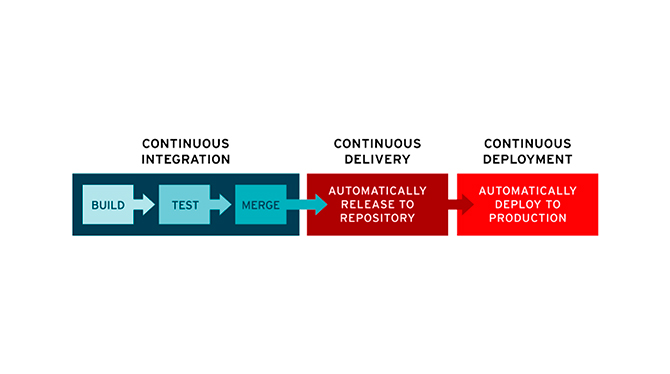

## Introduction
CD/CI are methods frequently used to deliver apps to customers making use of automation into the stages of the app development. The main concepts attributed to CD and CI are *Continuous Integration* for CI and *Continuous Delivery* and/or *Continuous Deployment* for CD. 
<p></p>

Both methods are quite common into the *DevOps* world. *DevOps* is a set of practices that brings together software development (Dev) and IT operations (Ops). Its goal is to make the software development lifecycle faster and provide high quality continuous delivery. But even though all three are part of the software delivery process, each has its own requirements, and more importantly, benefits. 
<p></p>

Understanding the differences between them it’s crucial to properly implementing them.

### CI (Continuous Integration)
Definition



### CI (Continuous Delivery)
Definition

### CI (Continuous Deployment)
Definition


<p>&nbsp;</p>


## How to config automatic builds with GitHub Actions
After this brief introduction on the pilar concepts about automatic builds, I’ll proceed with the teoric explanation of how to configurate automatic builds using GitHub Actions. But first of all, I would like to explain why you should use this method to create your GitHub builds:
- Avoid having the problems of “It worked on my machine when I built it”.
- Eliminates the human error possibility
- Validate that your builds are running on different platforms.

Now, with that beeing clear we can proceed to cerate a automated build with GitHub actions for the first time. The main steps are:
1. First we need to **create a repository** to be able to configure an automated build.

<p>&nbsp;</p>

2. Go to **Actions** in the menu above.

<p>&nbsp;</p>

3. Create a **new worklfow**.

<p>&nbsp;</p>

4. **Set up a workflow yourself**.

<p>&nbsp;</p>

5. Edit, and when you finish press **Start commit**.

<p>&nbsp;</p>

6. Go back to **Actions**.

<p>&nbsp;</p>

7. Go to the workflow you just created.

<p>&nbsp;</p>

8. **Run workflow**

<p>&nbsp;</p>

9. Check for possible errors.


<p>&nbsp;</p>


## Guide to write scripts
GitHub scripts are awesome actions that allows us to quickly interact with the GitHub **API**(application programming interface) directly from our workflow. More specifically, we will use the workflow context to script any API that we may need.
To be able to create, add or modify a script we need to:
1. Go to your workflows

<p>&nbsp;</p>

2.Open the .yml

<p>&nbsp;</p>

3. Make your changes!

  <p>&nbsp;</p>


### Example:
```yaml       
name: Learning GitHub Script

on:
  issues:
    types: [opened]

jobs:
  comment:
    runs-on: ubuntu-latest
    steps:
      - name: Comment on new issue
        uses: actions/github-script@0.8.0
        with:
          github-token: {% raw %${{secrets.GITHUB-TOKEN}}
          script: |
              github.issues.createComment({
              issue_number: context.issue.number,
              owner: context.repo.owner,
              repo: context.repo.repo,
              body: "🎉 You've created this issue comment using GitHub Script!!!"
            })
      - name: Add issue to project board
        if: contains(github.event.issue.labels.*.name, 'bug')
        uses: actions/github-script@0.8.0
        with:
          github-token: {% raw %${{secrets.GITHUB-TOKEN}}
          script: |
              github.projects.createCard({
              column.id: {{columID}},
              content_id: context.payload.issue.id,
              content_type: "Issue"
            })  
```           
            
            
In this example every time an issue gets opened in this repository the GitHub Script you wrote will be executed.
<p></p>

After doing a depth research about manual copying README files I came out with nothing. The only what I found was a script on how to render your README with GitHub Actions.

<p>&nbsp;</p>


## Automatically zip and upload back to github (CD)
```yaml
name: Create release

on:
 release:
   types:
     - created

jobs:
 build:
   runs-on: ubuntu-latest

   steps:
   - uses: actions/checkout@v2

   - name: Get Composer Cache Directory
     id: composer-cache
     run: |
       echo "::set-output name=dir::$(composer config cache-files-dir)"
   - uses: actions/cache@v2
     with:
       path: ${{ steps.composer-cache.outputs.dir }}
       key: ${{ runner.os }}-composer-${{ hashFiles('**/composer.lock') }}
       restore-keys: |
         ${{ runner.os }}-composer-

   - name: Install dependencies
     run: |
       composer install -o -q

   - name: Zip Folder
     run: zip -r ${{ github.event.repository.name }}.zip . -x ".git/*" ".github/*" "phpcs.xml" "composer.json" "composer.lock" ".gitignore"

   - name: Release
     uses: softprops/action-gh-release@v1
     if: startsWith(github.ref, 'refs/tags/')
     with:
       files: ${{ github.event.repository.name }}.zip
     env:
       GITHUB_TOKEN: ${{ secrets.GITHUB_TOKEN }}
```
<p>&nbsp;</p>


## Automatic builds and notifications
If you enable email or web notifications for GitHub Actions, you'll receive a notification when any workflow runs that you've triggered have completed. The notification will include the workflow run's status (including successful, failed, neutral, and canceled runs). You can also choose to receive a notification only when a workflow run has failed. For more information about enabling or disabling notifications, see "About notifications."
GitHub allows us to change our notification settings and manage our subscriptions. To do that we have to:
1. Click into the bell icon.

<p>&nbsp;</p>

2. Go to Manage notifications.

<p>&nbsp;</p>

3. Depending in if you want to change yout notification settings or manage your subscriptions you will chose between Notification settings or Subscriptions.

  <p>&nbsp;</p>
  
  A. Notification settings
  
  
  
  <p>&nbsp;</p>
  
  B. Subscriptions
  
  
  
  
  
  
<p>&nbsp;</p>


## Webgraphy
- What is CI/CD?:  <https://www.redhat.com/en/topics/devops/what-is-ci-cd>
- Intro to Continuous Integration, Continuous Delivery, and Continuous Deployment:  <https://www.indellient.com/blog/whats-the-difference-between-continuous-integration-continuous-delivery-and-continuous-deployment/>
- Continuous integration vs. delivery vs. deployment:  <https://www.atlassian.com/continuous-delivery/principles/continuous-integration-vs-delivery-vs-deployment>
- Understanding GitHub Actions:  <https://docs.github.com/en/actions/learn-github-actions/understanding-github-actions>
- How to Use Github Actions to Automate Your Repository Builds:  <https://www.cloudsavvyit.com/15207/how-to-use-github-actions-to-automate-your-repository-builds/>
- CI/CD for C/C++ games using GitHub Actions:  <https://thatonegamedev.com/cpp/ci-cd-for-c-c-games-using-github-actions/>
- How to automate the MSI Building with GitHub Actions:  <https://www.youtube.com/watch?v=T_Rj3_M-m8I>
- Introduction to Markdown:  <https://www.ionos.es/digitalguide/paginas-web/desarrollo-web/tutorial-de-markdown/>
